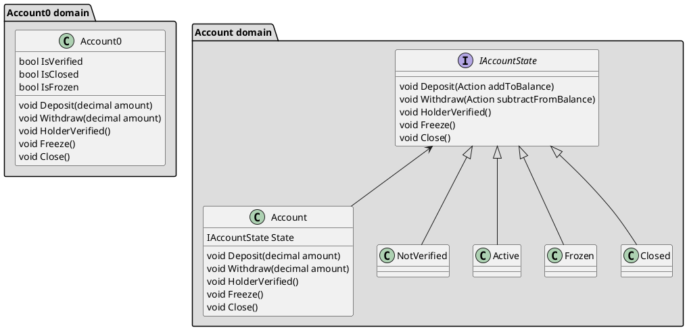

### uml: class diagram

```plantuml
@startuml
package "Account0 domain" #DDDDDD {
    class Account0 {
        bool IsVerified
        bool IsClosed
        bool IsFrozen
        void Deposit(decimal amount)
        void Withdraw(decimal amount)
        void HolderVerified()
        void Freeze()
        void Close()
    }

}

package "Account domain" #DDDDDD {
    class Account {
        IAccountState State
        void Deposit(decimal amount)
        void Withdraw(decimal amount)
        void HolderVerified()
        void Freeze()
        void Close()
    }

    interface IAccountState {
        void Deposit(Action addToBalance)
        void Withdraw(Action subtractFromBalance)
        void HolderVerified()
        void Freeze()
        void Close()
    }

    class NotVerified {

    }

    class Active {

    }

    class Frozen {

    }

    class Closed {

    }

    IAccountState <|-- NotVerified
    IAccountState <|-- Active
    IAccountState <|-- Frozen
    IAccountState <|-- Closed
    IAccountState <-- Account
}
@enduml
```