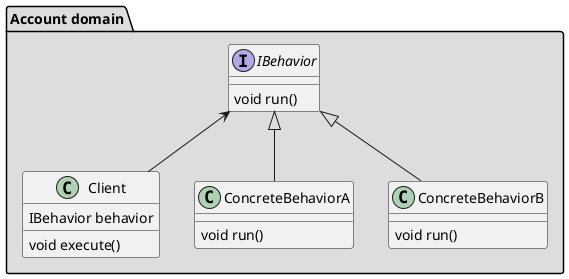

### uml: class diagram

```plantuml
@startuml

package "Account domain" #DDDDDD {
    class Client {
        IBehavior behavior
        void execute()
    }

    interface IBehavior {
        void run()
    }

    class ConcreteBehaviorA {
        void run()
    }

    class ConcreteBehaviorB {
        void run()
    }


    IBehavior <|-- ConcreteBehaviorA
    IBehavior <|-- ConcreteBehaviorB
    IBehavior <-- Client
}
@enduml
```