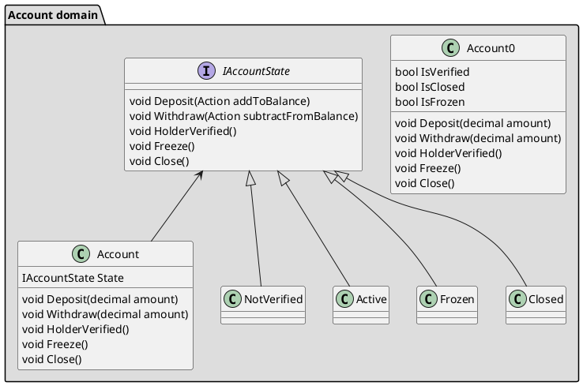

## State Pattern
* Object of the state class represents one state.
* Change the object when you want to change the state

* each operation to return next state

## Consequences of the State Pattern
* Class doesn't have to represent its state explicitly anymore.
* Class doesn't have to manage state transition logic.

* No more branching.
* Runtime type of the state object replaces branching.
* Dynamic dispatch used to choose one implementation or the other.

## Advice
* Let the class do only one thing.
* E.g. Account only takes care of the balance
* (a.k.a. Sigle Responsibility Principle - SRP)

### uml: class diagram
