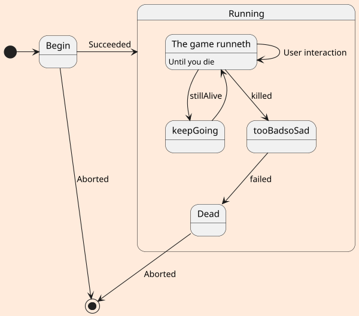
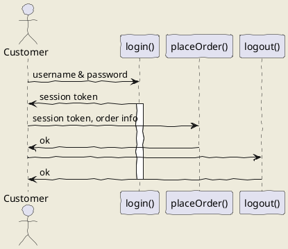
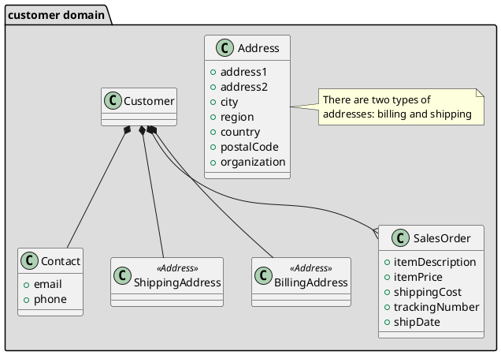

[用PlantUML+graphviz+C4 Model画架构图(IDEA版)](
https://www.toutiao.com/i6846736159398167052/?tt_from=weixin&utm_campaign=client_share&wxshare_count=1&timestamp=1594165430&app=news_article&utm_source=weixin&utm_medium=toutiao_ios&use_new_style=1&req_id=202007080743500100140411611293BBB0&group_id=6846736159398167052)

## uml: sequence diagram
Here I will embed PlantUML markup to generate a sequence diagram.

I can include as many plantuml segments as I want in my Markdown, and the diagrams can be of any type supported by PlantUML.

## uml: state diagram

### uml: class diagram
