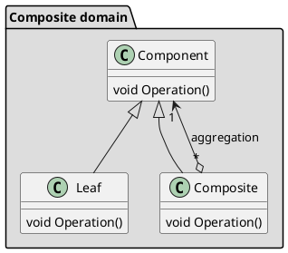

### Composite: class diagram
* Compose a number of objects into a new object exposing the same public interface.
* Composite object looks like a single object
  * It can receive method calls just like a single object does

