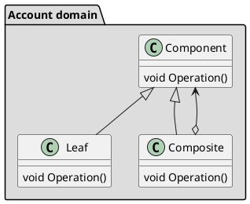

### Composite: class diagram

```plantuml
@startuml

package "Account domain" #DDDDDD {

    class Component {
        void Operation()
    }

    class Leaf {
        void Operation()
    }

    class Composite {
        void Operation()
    }

    Component <|-- Composite
    Component <|-- Leaf
    Component <--o Composite

}
@enduml
```